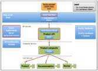
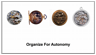
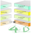
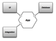
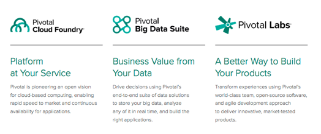
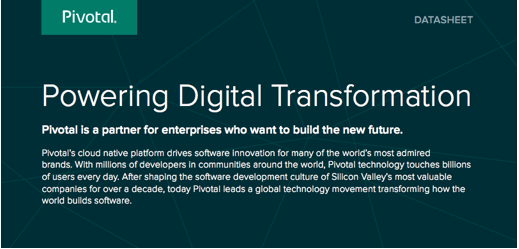

image:ArchOverviewOnePager_files/image001.png[Text Box: Thank
you!,width=165,height=47]http://callistaenterprise.se/blogg/teknik/2015/04/27/building-microservices-part-3,%20secure%20API's%20with%20OAuth/[]image:ArchOverviewOnePager_files/image003.png[Text
Box: Ÿ Motivations for Modern Architectures – Trend from 3D to 4D
Architecture – The 4th D is Change – Autonomy allows for Change Ÿ
Approaches and Frameworks – Spring and Related Frameworks – Autonomous
Business Services – Steps to Fine-grained Autonomy – Examples Ÿ How
Pivotal helps Enterprises Transform – Application Infrastructure (
Spring and Cloud Foundry) – Labs (Agile, DevOps, Data Science) – MPP
Analytics (Greenplum, Hadoop, and Hawq)
,width=165,height=348]image:ArchOverviewOnePager_files/image004.png[Text
Box: Questions for Pivotal: • MDM Strategies that work with
Microservices • How to validate data integrity when it cuts across
service boundaries • Propagating changes between parent and child
services Questions for customer: • Scope and timing of first project to
target a new architecture • List of technical requirements that might be
challenging
,width=165,height=313]image:ArchOverviewOnePager_files/image005.png[Text
Box: Next Steps: • Review Data Strategies • Labs Visit • Cloud Foundry
Overview
,width=165,height=96]image:ArchOverviewOnePager_files/image006.png[Text
Box: Follow
Up,width=165,height=55]image:ArchOverviewOnePager_files/image007.png[Text
Box: • Mary Meeker KPCB o Internet trends • Neal Ford o Architecture
Trends (4D) • Amazon Deck on Innovation • Hexagonal Architecure •
Comparison of Spring and Dropwizard • Synerzip • Callista • Lambda Arch.
• Etrade and Kafka • Conference on Distributed Event-Based Systems
(DEBS) o Lambda Example w/Spring
,width=165,height=344]http://media.amazonwebservices.com/jp/summit2014/TE-01.pdf[]https://player.oreilly.com/videos/9781491932636[]http://alistair.cockburn.us/Hexagonal+architecture[]http://www.kpcb.com/internet-trends[]image:ArchOverviewOnePager_files/image012.png[Text
Box:
Agenda,width=165,height=52]image:ArchOverviewOnePager_files/image013.png[Text
Box: Dig Deeper (List of References) ,width=166,height=52] +
image:ArchOverviewOnePager_files/image014.png[Text Box: • Creators and
founding member of Cloud Foundry; founding member of the ODPi
communities • 1000+ Fortune 2000 companies as customers • ~1,800 of the
world’s top developers, engineers, consultants, and professionals • EMC,
VMware and $105M investment by GE • Silicon Valley headquarters, 14
offices across globe • 130+ infrastructure, consulting, and technology
provider partners Trusted by Companies Around the Globe Southwest Indian
Railways CoreLogic Philips Comcast Hulu Groupon Mercedes-Benz Netflix
Sundance Institute UnionBank BMW Humana
,width=175,height=462]  image:ArchOverviewOnePager_files/image017.png[Text
Box: Aliquam consectetuer posuere
lorem.,width=521,height=52]image:ArchOverviewOnePager_files/image018.png[Text
Box: Why Pivotal? ,width=175,height=53]
